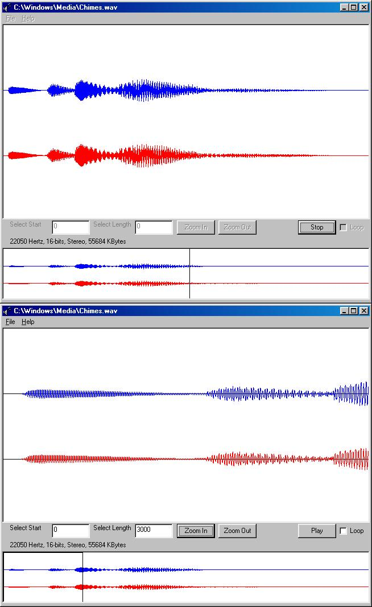

<div align="center">

## A program that reads a wave file and displays its wave sample and formats \(ie\. 22050 Hertz, 16\-bits\)


</div>

### Description

This is an update of the 'Read a wave file' code that I have submitted a couple of years ago. The old code does not read a wave file in a correct way, and I feel that it does not provide enough helps. Therefore, I used the correct way to read the wave file in this project. This program demonstrates how to read a wave file and displays the wave samples (If there is more than one channel i.e. Stereo, it will display those two channels separately. See Screenshots), Samples rates per second (i.e. Hertz), Average bytes per second (How many bytes play every second), Bits per sample (Bit resolution of a sample point. i.e. 16-bits) and the length of the wave file in terms of seconds. The program also allows the user to enlarge a specific section of the wave file (See Screenshots). When the user plays the wave file, he or she will be able to see a line that indicates the byte that is being play (See Screenshots). THIS PROGRAM IS A MUST SEE! Feel free to leave any comments and questions.
 
### More Info
 
No Side Effects


<span>             |<span>
---                |---
**Submitted On**   |2001-08-19 14:26:44
**By**             |[Altis](https://github.com/Planet-Source-Code/PSCIndex/blob/master/ByAuthor/altis.md)
**Level**          |Advanced
**User Rating**    |4.6 (41 globes from 9 users)
**Compatibility**  |VB 5\.0, VB 6\.0
**Category**       |[Complete Applications](https://github.com/Planet-Source-Code/PSCIndex/blob/master/ByCategory/complete-applications__1-27.md)
**World**          |[Visual Basic](https://github.com/Planet-Source-Code/PSCIndex/blob/master/ByWorld/visual-basic.md)
**Archive File**   |[A program 249378192001\.zip](https://github.com/Planet-Source-Code/altis-a-program-that-reads-a-wave-file-and-displays-its-wave-sample-and-formats-ie-22050-h__1-26377/archive/master.zip)

### API Declarations

```
Public Declare Function sndPlaySound Lib "winmm.dll" Alias "sndPlaySoundA" (ByVal lpszSoundName As String, ByVal uFlags As Long) As Long
Public Enum sndConst
 SND_ASYNC = &H1 ' play asynchronously
 snd_loop = &H8 ' loop the sound until Next sndPlaySound
 SND_MEMORY = &H4 ' lpszSoundName points To a memory file
 SND_NODEFAULT = &H2 ' silence Not default, If sound not found
 SND_NOSTOP = &H10 ' don't stop any currently playing sound
 SND_SYNC = &H0 ' play synchronously (default), halts prog use till done playing
End Enum
```


